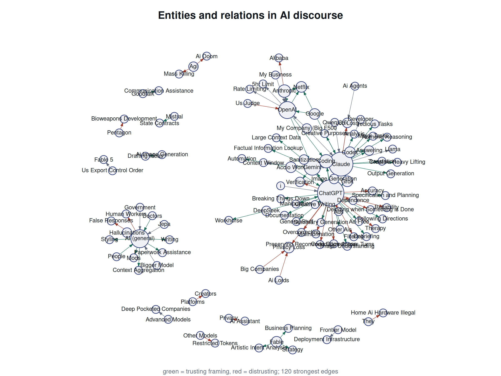

# 📊 Trust, Incivility and Public Perceptions of Generative AI

> What happens to a study's conclusions when you stop trusting the classifier that produced them.

This project measures how trust and distrust toward generative AI are expressed across 825,000 Reddit comments, which topics dominate that discussion, and how uncivil communication relates to both. The twist is methodological: every number an automated classifier produces is treated as an instrument reading, not a measurement, and corrected for its own error against a human-coded gold standard before it's reported.



*The exploratory knowledge graph: which AI systems are trusted for which capabilities, and distrusted for which harms.*

## 🧩 Problem

Computational text analysis on discourse about AI almost always reports classifier output directly, as if a dictionary hit or a language-model label were an observation rather than a guess. Comparative work on identical texts shows dictionaries perform worst, supervised learning better, and human coders best, yet the instruments ranked lowest are the ones most often used to generate the headline numbers, with no accompanying estimate of their error. When those predicted labels enter a later analysis as if they were ground truth, the resulting estimates aren't just noisy, they're displaced, and the intervals reported around them understate how wrong they might be.

## 🏁 Objective

Three research questions drive the analysis:

1. How are trust and distrust toward Generative AI expressed in online discussions?
2. Which topics dominate public discussions about Generative AI?
3. How does the occurrence of uncivil communication differ across AI-related topics and trust categories?

The standard held throughout: no population estimate ships without an error correction behind it, and no correction ships without the human-coded sample that makes it valid.

## 💡 Solution

A stratified probability sample is drawn from the corpus with recorded inclusion probabilities, a random subset of it is coded by hand by two independent coders, and four families of measurement approach (a word list, a sentiment dictionary, large-language-model annotation, and a distilled classifier trained on the LLM's own labels) are scored against that human standard on a reserved test split. Every corpus-scale estimate is then corrected using design-based supervised learning (Egami et al., 2023), which combines the classifier's prediction for every comment with the human label for the comments that happen to be coded, weighted by each comment's known probability of being selected. The correction doesn't sharpen the study's conclusions, it changes them.

## ✨ Key findings

- **The correction matters more than the method.** Raw classifier output would have placed incivility at 2.9% of the corpus; corrected for classifier error, it's 15.0%, a fivefold change.
- **The correction reverses a ranking.** Uncorrected, r/ChatGPT looks like the most hostile community; corrected, r/artificial is. A report of raw classifier output would have published the wrong answer.
- **Distrust runs about two to one over trust.** 31.5% of comments express distrust, 16.2% express trust, corrected for measurement error.
- **Distrust concentrates on competence, not motives.** 63.8% of evaluative comments concern whether a system works reliably; integrity, safety and transparency together account for a minority of the evaluative mass.
- **A distrusting comment is ~5x more likely to be uncivil** than a non-evaluative one (odds ratio 4.94), and a reply to an uncivil comment is ~3.5x more likely to be uncivil itself, holding topic, community and thread constant.
- **No single topic dominates discussion** (14 modelled topics, largest holds ~9%), but topics concerning institutions (regulation, corporate conduct) are overwhelmingly critical, while discussion of raw product capability is the only theme where trust edges out distrust.
- **Measurement quality varies enormously by instrument.** Macro-F1 on stance ranges from 0.310 (sentiment dictionary) to 0.717 (agreement-based LLM ensemble), on the same 150 human-coded test comments.

## ⚙️ How it works

Every stage writes its output to disk before the next one reads it, so any stage can be re-run independently and the whole chain is auditable after the fact. Nothing downstream of the human-coded sample ever treats a classifier's guess as if it were an observation without correcting for how often that classifier is wrong.

## 🏗️ Architecture

```text
Raw Reddit archive (Arctic Shift bulk dump, 4 subreddits, 6 months)
        |
        v
Ingest to Parquet --> corpus cleaning funnel --> stratified probability sample
        |
        +--> Coding instrument generation --> two independent human coders
        |                                            |
        v                                            v
LLM annotation (multi-pass, multi-family)  <-- scored against --> intercoder reliability (Krippendorff's alpha)
        |
        v
Four measurement approaches validated against the human gold standard
(word list, dictionary, LLM ensemble, distilled classifier)
        |
        v
Design-based supervised learning correction (classifier output + human labels,
weighted by design-based inclusion probability)
        |
        +--> Seeded + unsupervised topic models (cross-checked against each other)
        +--> Multilevel logistic regression of incivility (thread random intercept)
        +--> Exploratory signed knowledge graph (entities, relations, valence)
        |
        v
Corrected prevalence estimates, odds ratios, and topic structure, each with an interval
```

## 🧱 Technology stack

**Core analysis (R)**
- `data.table`, `arrow` — data handling at corpus scale
- `glmnet` — the distilled classifier
- `glmmTMB` — multilevel logistic regression
- `quanteda`, `seededlda` — text handling and the seeded topic model
- `igraph` — knowledge graph construction and Leiden community detection
- `irr` — intercoder reliability (Krippendorff's alpha)

**Python sidecars**
- `duckdb` — raw JSONL to Parquet ingestion
- `sentence_transformers`, `scikit-learn`, `torch` — sentence embeddings and the independent embedding-based topic clustering
- `umap` — dimensionality reduction for the data-driven topic check

**Report**
- Quarto + R, rendered to PDF (via `xelatex`) and HTML

## 📁 Repository structure

```text
.
├── R/                        every analysis script, numbered by pipeline stage
│   ├── 00_ingest.py              raw JSONL -> Parquet
│   ├── 01_corpus.R                cleaning funnel, relevance screen
│   ├── 02_sample.R                 stratified probability sample
│   ├── 03_make_coding_*.R          coding instrument generation
│   ├── 04_llm_annotate.R           LLM annotation (multi-pass, multi-family)
│   ├── 05_reliability.R            intercoder reliability
│   ├── 07_embed.py                 sentence embeddings
│   ├── 08_lexicon.R                word list + dictionary baselines
│   ├── 09_validate.R               instrument validation against the gold standard
│   ├── 10_distill.R                distilled classifier
│   ├── 11_topics.R / 11b_*.py      seeded LDA + independent embedding clustering
│   ├── 12_models.R                 multilevel logistic regression + DSL correction
│   ├── 13_graph.R                  exploratory signed knowledge graph
│   └── 14-17_*.R                   figures, report checks, report listings
├── coding/                   the coding instrument and both coders' completed sheets
├── docs/
│   ├── codebook.md                the full coding scheme, machine-readable source of truth
│   └── figures/                   report figures
├── output/
│   ├── tables/                    every number in the report, as a CSV
│   └── listings/                  numbered console listings behind each report check
└── run_all.R                 driver for the first few pipeline stages
```

`docs/codebook.md` is the single source the coder instructions, the annotation prompts, and the response schema are all generated from, so no annotator (human or model) can return a label outside the scheme.

## ✅ Prerequisites

- R 4.3+ with the packages listed above
- Python 3 with `duckdb`, `pandas`, `sentence_transformers`, `scikit-learn`, `torch`, `umap-learn`
- A personal Groq API key for the LLM annotation stages (free tier is enough; never commit it)
- The raw dataset is not included in this repository (see **Data** below)

## 🚀 Reproducing the analysis

Scripts are numbered in run order; run `.R` files with `Rscript` and `.py` files with `python`:

```bash
python R/00_ingest.py
Rscript R/01_corpus.R
Rscript R/02_sample.R
# ... continuing through R/17_report_listings.R
```

`run_all.R` automates the first few stages. The Groq-dependent stages (`04_llm_annotate.R`, `13_graph.R`, and the optional `04b_selfconsistency.R` / `06_variants.R`) are rate-limited by the free tier's daily quota and can't be finished in one sitting. Two stages in the middle of the chain, human coding of the sampled comments and the manual groundedness check of the knowledge graph, are conducted by hand rather than by script; every other stage is fully scripted and reproducible from the outputs this repository already ships in `output/`.

## 🧭 Data

The raw dataset (four subreddits, six months, ~2.2 GB of JSON Lines, sourced from the Arctic Shift bulk archive rather than the Reddit API) is not redistributed in this repository. Comments are pseudonymous rather than anonymous, and a verbatim quotation is searchable back to its author, so the project's own ethics practice is to redistribute by comment identifier rather than by text. `output/tables/` and `output/listings/` ship every number and intermediate result the analysis produced, so the full analysis is auditable even without the raw text.

## 🚧 Constraints

Selection within each sampling stratum begins at a fixed rather than a random position, so the inclusion probabilities the correction relies on are nominal rates, checked (not assumed) against balance and randomisation diagnostics. The gold standard behind every corrected estimate is a single set of 358 human-coded comments serving every construct at once, so rarer categories rest on fewer positive instances than commoner ones. Two stance categories (trust, ambivalent) are completely separated in the incivility model and cannot be estimated at all; the reported comparison is distrust against non-evaluative comments only. The knowledge graph is exploratory: its extraction is LLM-based, checked only against a lightweight groundedness spot-check (do the named entities actually appear in the source comment), not a full human-coded precision estimate.

## 📊 Results at a glance

| Quantity | Uncorrected | Corrected |
|---|---|---|
| Takes a position on AI | 30.3% | 64.1% |
| Expresses distrust | 24.0% | 31.5% |
| Expresses trust | 11.5% | 16.2% |
| Is uncivil | 2.9% | 15.0% |

| Instrument (stance) | Macro F1 |
|---|---|
| Sentiment dictionary | 0.310 |
| Single LLM | ~0.60 |
| Two-model agreement ensemble | 0.717 |

Full tables, figures, and the complete written report are produced by the Quarto source this repository's pipeline feeds into.

## 📜 Provenance

Built for a seminar project on computational methods and social media data analysis. Human coding, sampling design, and error correction follow Egami et al. (2023) and Krippendorff (2018); the seeded topic model follows Watanabe & Zhou (2022). See `docs/codebook.md` for the full coding scheme and citations.

## 📄 License

MIT — see `LICENSE`. The code and documentation in this repository are free to reuse; the underlying Reddit data is not redistributed here (see **Data** above).
